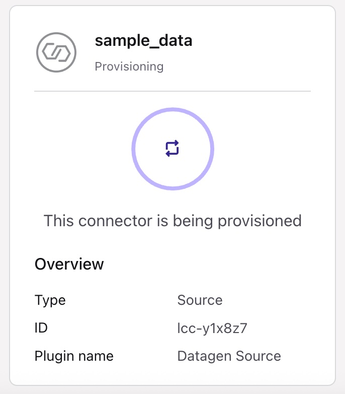

# Confluent's Fully Managed Connector (FMC) for MongoDB Atlas

<br>

# Overview

🚀 Welcome to your no-code journey with **Confluent’s Fully Managed Connector (FMC) for MongoDB Atlas** — designed for **AI-powered data pipelines**.  
In just a browser, you’ll build a streaming flow from **mock data → Kafka → MongoDB Atlas**, with bonus steps to add **OpenAI embeddings** along the way.

### What you’ll accomplish
- ✅ **Task 01**: Stream mock data into a Confluent Cloud Kafka topic  
- ✅ **Task 02**: Create a MongoDB Atlas collection as the destination  
- ✅ **Task 03**: Configure the FMC sink connector and watch your data flow in real time  
- 💡 Bonus Task 01: Connect Flink with OpenAI and unlock AI-powered data enrichment
- 💡 Bonus Task 02: Write a Flink SQL statement to generate embeddings and stream them into a brand-new topic
- 💡 Bonus Task 03: Use the FMC again to sink your enriched data — embeddings included — back into MongoDB Atlas


> **Assumptions**  
> - You have a web browser  
> - (Optional) You have an OpenAI API key for the bonus tasks  

> **Why no-code?**  
> - It shows just how far you can get with only the UI — no Terraform, no SDKs, no code!  
> - Perfect for demos, learning, or enabling teammates quickly  

⚡ By the end, you’ll **see live data flowing end-to-end** — and have a pattern you can automate later.

⚠️ **Reminder**: Tear down your connector in Confluent Cloud when finished to avoid charges.  
💡 **Tip**: If you get stuck, try the **Confluent AI Assistant** in the Cloud UI — it can answer questions and even generate code.

<br>

## Task 01: Write data into a Confluent Cloud kafka topic using mock data simulator

1. **Log in to Confluent Cloud**  
   - Go to [https://confluent.cloud](https://confluent.cloud)
   - If you don’t already have an environment or cluster, create one now.  
   - Otherwise, skip ahead to adding your first connector.

<table>
  <tr>
    <td>
      <a href="./images/create_cfltenvironment.jpg" target="_blank">
        
      </a>
    </td>
  </tr>
  <tr>
    <td>
      <a href="./images/create_cfltenvironment2.jpg" target="_blank">
        
      </a>
    </td>
  </tr>
  <tr>
    <td>
      <a href="./images/create_cfltenvironment3.jpg" target="_blank">
        
      </a>
    </td>
  </tr>
  <tr>
    <td>
      <a href="./images/create_cfltenvironment4.jpg" target="_blank">
        
      </a>
    </td>
  </tr>
  <tr>
    <td>
      <a href="./images/create_cfltenvironment5.jpg" target="_blank">
        
      </a>
    </td>
  </tr>
</table>

2. **Add the Datagen Connector**  
   - Navigate to: `<your environment> / <your cluster> / Connectors / + Add Connector`  
   - Search for **Datagen** and select **Sample Data**  
   - Click **Get Started** and **Launch** (no additional config needed)  
<table>
  <tr>
    <td>
      <a href="./images/create_datagenconnector.jpg" target="_blank">
        
      </a>
    </td>
  </tr>
  <tr>
    <td>
      <a href="./images/create_datagenconnector1.jpg" target="_blank">
        
      </a>
    </td>
  </tr>
</table> 

3. **Verify the connector is running**  
   - Status will change from *Provisioning* → *Running*  
   - Click into the connector and explore the tabs: **Overview**, **Logs**, **Settings**  
   - In *Settings*, note the automatically created topic (e.g. `sample_data_orders`)
<table>
  <tr>
    <td>
      <a href="./images/create_datagenconnector2.jpg" target="_blank">
        
      </a>
    </td>
  </tr>
  <tr>
    <td>
      <a href="./images/create_datagenconnector3.jpg" target="_blank">
        
      </a>
    </td>
  </tr>
  <tr>
    <td>
      <a href="./images/create_datagenconnector4.jpg" target="_blank">
        
      </a>
    </td>
  </tr>
</table> 

4. **Inspect the topic**  
   - Navigate to: `<your environment> / <your cluster> / Topics`  
   - Select the topic (e.g. `sample_data_orders`) and view messages  
<table>
  <tr>
    <td>
      <a href="./images/create_datagenconnector5.jpg" target="_blank">
        
      </a>
    </td>
  </tr>
  <tr>
    <td>
      <a href="./images/create_datagenconnector6.jpg" target="_blank">
        
      </a>
    </td>
  </tr>
  <tr>
    <td>
      <a href="./images/create_datagenconnector7.jpg" target="_blank">
        
      </a>
    </td>
  </tr>
</table> 

5. **Check the data contract (Schema Registry)**  
   - Click **Data Contract** in the topic view  
   - Congrats — you’re using Confluent Schema Registry behind the scenes!  
   - To explore further, go to: `<your environment> / <Schema Registry>`
<table>
  <tr>
    <td>
      <a href="./images/create_datagenconnector8.jpg" target="_blank">
        
      </a>
    </td>
  </tr>
  <tr>
    <td>
      <a href="./images/create_datagenconnector9.jpg" target="_blank">
        
      </a>
    </td>
  </tr>
</table> 

✅ At this point, you have a **mock data stream flowing into a Confluent Kafka topic**.  
Next, we’ll create a MongoDB Atlas collection to receive it.

<br>

## Task 02: Create a home for this new data in MongoDB Atlas

1. **Log in to MongoDB Atlas**  
   Go to [https://cloud.mongodb.com](https://cloud.mongodb.com) and create a **new project** with you as the Project Owner.
  <table>
    <tr>
      <td>
        <a href="./images/create_mdbenvironment.jpg" target="_blank">
          
        </a>
      </td>
    </tr>
    <tr>
      <td>
        <a href="./images/create_mdbenvironment1.jpg" target="_blank">
          
        </a>
      </td>
    </tr>
  </table> 

2. **Create a cluster**  
   - Tier: **FREE** is fine  
   - Name: **ClusterCFLT0**  
   - Provider: **AWS** (use the same region as your Confluent Cloud cluster, e.g. `us-east-1`)  
   - Click **Create Deployment**
  <table>
    <tr>
      <td>
        <a href="./images/create_mdbenvironment2.jpg" target="_blank">
          
        </a>
      </td>
    </tr>
  </table> 

3. **Set up access**  
   - Create a database user (save the username/password)  
   - Under **Network Access**, you may temporarily allow connections from anywhere for simplicity  

   > 💡 **Pro tip**: Restrict by IP later for production.
<table>
  <tr>
    <td>
      <a href="./images/create_mdbenvironment3.jpg" target="_blank">
        
      </a>
    </td>
  </tr>
  <tr>
    <td>
      <a href="./images/create_mdbenvironment4.jpg" target="_blank">
        
      </a>
    </td>
  </tr>
</table> 

4. **Create a database + collection**  
   Under your new cluster, click **Collections** and create:  
   - Database: **mytest_fmc**  
   - Collection: **sample_data_orders**
   
   By default, MongoDB Atlas will create a sample_netflix dataset for you. That's fine. But we will create a new one.
   
   It's worth calling out that sometimes the drop down for Additional Preferences may take a minute or two to load after first creating a cluster.
<table>
  <tr>
    <td>
      <a href="./images/create_mdbenvironment5.jpg" target="_blank">
        
      </a>
    </td>
  </tr>
</table> 

✅ At this point, you have a **a home for your data in MongoDB Atlas**.  
Next, we’ll create a FMC connector to send data from Confluent Cloud to MongoDB Atlas.

<br>

## Task 03: Setup a MongoDB Atlas FMC as a sink and watch data flow from that topic into your MongoDB Atlas database!

1. **Add the MongoDB Atlas Sink Connector**  
   - Navigate to: `<your environment> / <your cluster> / Connectors / + Add Connector`  
   - Search for **MongoDB Atlas Sink** and select it  
<table>
  <tr>
    <td>
      <a href="./images/create_fmcconnector.jpg" target="_blank">
        
      </a>
    </td>
  </tr>
</table> 

2. **Choose the source topic**  
   - Select your mock data topic (e.g. `sample_data_orders`) from the list  
<table>
  <tr>
    <td>
      <a href="./images/create_fmcconnector1.jpg" target="_blank">
        
      </a>
    </td>
  </tr>
</table> 

3. **Configure authentication**  
   - Option 1: Use an existing cluster-level API key  
   - Option 2 (recommended here): Create a **Service Account**  
     - Name: `mymdb_fmc_sa`  
     - Description: “For exercise only; safe to delete after”  
     - Select **Add all required ACLs**
<table>
  <tr>
    <td>
      <a href="./images/create_fmcconnector2.jpg" target="_blank">
        
      </a>
    </td>
  </tr>
  <tr>
    <td>
      <a href="./images/create_fmcconnector3.jpg" target="_blank">
        
      </a>
    </td>
  </tr>
</table> 

4. **Enter MongoDB Atlas connection details**  
   - Example:  
     ```
     clustercflt0.k61f7hd.mongodb.net/?retryWrites=true&w=majority&appName=ClusterCFLT0
     ```  
   - Click **Continue** to test the connection  
   - If there’s a Confluent ↔ MongoDB region mismatch, Atlas will flag it  
<table>
  <tr>
    <td>
      <a href="./images/create_fmcconnector4.jpg" target="_blank">
        
      </a>
    </td>
  </tr>
</table> 

5. **Select data format**  
   - If you want to test error handling, choose **JSON** (and watch DLQ activity)  
   - Otherwise, choose **JSON_SR** for schema-registry–aware JSON  
<table>
  <tr>
    <td>
      <a href="./images/create_fmcconnector5.jpg" target="_blank">
        
      </a>
    </td>
  </tr>
</table> 

6. **Finalize and launch**  
   - Keep **1 task** (default)  
   - Name the connector, e.g. `MDBAtlasFMC_Connector`  
   - Launch → Status will show *Provisioning* then *Running*  
<table>
  <tr>
    <td>
      <a href="./images/create_fmcconnector6.jpg" target="_blank">
        
      </a>
    </td>
  </tr>
  <tr>
    <td>
      <a href="./images/create_fmcconnector7.jpg" target="_blank">
        
      </a>
    </td>
  </tr>
</table> 

7. **Verify data is flowing**  
   - Open your MongoDB Atlas cluster → Collections → confirm data is arriving in mytest_fmc.sample_data_orders
   - In the connector view, check stats (may take a minute)  
   - If you selected JSON earlier, you might see errors in the DLQ — try pausing, switching to **JSON_SR**, then resuming  
<table>
  <tr>
    <td>
      <a href="./images/create_fmcconnector8.jpg" target="_blank">
        
      </a>
    </td>
  </tr>
</table> 

   - If you chose JSON to see some errors, see if you can figure out how to Pause the connector, edit the settings to JSON_SR, click Apply Changes and Resume the connector.
<table>
  <tr>
    <td>
      <a href="./images/create_fmcconnector9.jpg" target="_blank">
        
      </a>
    </td>
  </tr>
  <tr>
    <td>
      <a href="./images/create_fmcconnector10.jpg" target="_blank">
        
      </a>
    </td>
  </tr>
</table> 

   - Now you will see messages being processed successfully.
<table>
  <tr>
    <td>
      <a href="./images/create_fmcconnector11.jpg" target="_blank">
        
      </a>
    </td>
  </tr>
</table> 

   - Open your MongoDB Atlas cluster → **Collections** → confirm data is arriving in `mytest_fmc.sample_data_orders`  
<table>
  <tr>
    <td>
      <a href="./images/create_fmcconnector12.jpg" target="_blank">
        
      </a>
    </td>
  </tr>
</table> 

<br>

## Bonus Task 01: Create an integration with OpenAI

1. **Open the Integrations tab**  
   - Navigate to: `<your environment> / Integrations`  
   - Click **Connections** → **+ Add connection**  

2. **Select OpenAI as the service provider**  
   - Choose **OpenAI** from the list  
<table>
  <tr>
    <td>
      <a href="./images/bonus_step1_setup_intg_openai.jpg" target="_blank">
        
      </a>
    </td>
  </tr>
</table> 

3. **Provide authentication details**  
   - Enter your **OpenAI API key**  
   - Review the details and click **Create connection**  
<table>
  <tr>
    <td>
      <a href="./images/bonus_step1_setup_intg_openai1.jpg" target="_blank">
        
      </a>
    </td>
  </tr>
</table> 

4. **Name your connection**  
   - Example: `openai-connection`  
<table>
  <tr>
    <td>
      <a href="./images/bonus_step1_setup_intg_openai2.jpg" target="_blank">
        
      </a>
    </td>
  </tr>
  <tr>
    <td>
      <a href="./images/bonus_step1_setup_intg_openai3.jpg" target="_blank">
        
      </a>
    </td>
  </tr>
</table> 

✅ You now have a working **OpenAI connection** in Confluent Cloud.  
In the next step, you’ll use it with Flink SQL to generate embeddings.

<br>

## Bonus Task 02: Create a Flink SQL statement to use the integration and store embeddings in another topic

1. **Create a Flink compute pool**  
   - Navigate to `<your environment>`  
   - Create a new **Flink compute pool** (at the environment level) — this gives you a workspace to run Flink SQL 
<table>
  <tr>
    <td>
      <a href="./images/create_cfltenvironment_flink.jpg" target="_blank">
        
      </a>
    </td>
  </tr>
  <tr>
    <td>
      <a href="./images/create_cfltenvironment_flink1.jpg" target="_blank">
        
      </a>
    </td>
  </tr>
  <tr>
    <td>
      <a href="./images/create_cfltenvironment_flink2.jpg" target="_blank">
        
      </a>
    </td>
  </tr>
</table> 

2. **Open Flink SQL Workspace**  
   - Go to the Flink SQL Workspace attached to your compute pool  
   - Run the following to create a model using the OpenAI connection:
```sql
CREATE MODEL openai_vector_encoding
INPUT (input STRING)
OUTPUT (vector ARRAY<FLOAT>)
WITH(
  'TASK' = 'embedding',
  'PROVIDER' = 'openai',
  'OPENAI.CONNECTION' = 'openai-connection'
);
```
<table>
  <tr>
    <td>
      <a href="./images/bonus_step2_create_openaimodel.jpg" target="_blank">
        
      </a>
    </td>
  </tr>
</table> 

3. **Test the model**
   - Run a query to generate embeddings for your mock order data.
```sql
SELECT * FROM sample_data_orders, 
  LATERAL TABLE(ML_PREDICT('openai_vector_encoding', CONCAT('Location: ', address.city, ', ', address.state, ' ', CAST(address.zipcode AS STRING), ' - Item: ', itemid)));
```
<table>
  <tr>
    <td>
      <a href="./images/bonus_step2_create_mldpredict.jpg" target="_blank">
        
      </a>
    </td>
  </tr>
</table> 

4. **Create a new table/topic to store embeddings**
   - Define a new table/topic where embeddings will be written.
```sql
CREATE TABLE sample_data_orders_withembeddings (
    input_string STRING,
    vector ARRAY<FLOAT>
);
```

5. **Write embeddings into the new table/topic**
   - Insert rows into the new table/topic with the generated embeddings.
```sql
INSERT INTO sample_data_orders_withembeddings
SELECT 
    CONCAT('Location: ', address.city, ', ', address.state, ' ', CAST(address.zipcode AS STRING), ' - Item: ', itemid) AS input_string,
    embedding_result.vector
FROM sample_data_orders, 
LATERAL TABLE(ML_PREDICT(
    'openai_vector_encoding', 
    CONCAT('Location: ', address.city, ', ', address.state, ' ', CAST(address.zipcode AS STRING), ' - Item: ', itemid)
)) AS embedding_result;
```
<table>
  <tr>
    <td>
      <a href="./images/bonus_step2_create_saveembeddings.jpg" target="_blank">
        
      </a>
    </td>
  </tr>
</table> 

6. **Verify results**
   - Open the topic/table **sample_data_orders_withembeddings** and confirm messages with an `input_string` and a `vector` array are present.
<table>
  <tr>
    <td>
      <a href="./images/bonus_step2_create_dataiswritten.jpg" target="_blank">
        
      </a>
    </td>
  </tr>
  <tr>
    <td>
      <a href="./images/bonus_step2_create_dataiswritten1.jpg" target="_blank">
        
      </a>
    </td>
  </tr>
</table> 

✅ You now have a **Kafka topic enriched with OpenAI embeddings**, ready to be synced back into MongoDB in Bonus Task 03.

<br>

## Bonus Task 03: Sink your new data to MongoDB Atlas using a FMC

1. **Create the destination collection**  
   In MongoDB Atlas → your cluster → **Collections**, create:
   - Database: **mytest_fmc**
   - Collection: **sample_data_orders_withembeddings**
<table>
  <tr>
    <td>
      <a href="./images/bonus_step3_savetomongo.jpg" target="_blank">
        
      </a>
    </td>
  </tr>
</table> 

2. **Add a new MongoDB Atlas Sink connector**  
   - Navigate to: `<your environment> / <your cluster> / Connectors / + Add Connector`  
   - Select **MongoDB Atlas Sink**

3. **Configure the connector**  
   - **Source topic**: `sample_data_orders_withembeddings`  
   - **Authentication**: reuse your **Service Account** from Task 03 (or an existing API key)  
   - **MongoDB connection**: same connection string you used earlier  
   - **Target**: Database = `mytest_fmc`, Collection = `sample_data_orders_withembeddings`  
   - **Data format**: choose **AVRO**.  
     > If you previously chose **JSON** or something else, you may see DLQ entries; switch to **AVRO** and resume.

4. **Launch and verify**  
   - Launch the connector → watch status move from *Provisioning* → *Running*  
   - Check the **Overview/Stats** tab; DLQ should be quiet once formats match  
   - In MongoDB Atlas, open **Collections** and verify documents are arriving.  
     Example document shape:
     ```json
     {
       "input_string": "Location: Austin, TX 73301 - Item: 42",
       "vector": [0.0123, -0.0456, 0.0031, ...]
     }
     ```
<table>
  <tr>
    <td>
      <a href="./images/bonus_step3_savetomongo1.jpg" target="_blank">
        
      </a>
    </td>
  </tr>
</table> 

✅ You’ve closed the loop: **Kafka → OpenAI embeddings (Flink) → MongoDB Atlas** via FMC.

💡 Tip: If you hit connection test failures, double-check cloud provider/region alignment and network access/IP allowlist in Atlas.

<br>

## Final Thoughts

🎉 Congratulations!  

By completing this walkthrough you have:  
- Set up a **mock data stream** in Confluent Cloud  
- Created a **MongoDB Atlas database + collection**  
- Used the **Fully Managed Connector (FMC)** to sync data into Atlas  
- (Optional) Explored **Flink + OpenAI** to enrich data with embeddings and sink them back into MongoDB  

> 💡 **Reminder**: Don’t forget to **tear down your environment** (connectors, clusters, etc.) to avoid ongoing charges.  

> ✅ **Tip**: The same workflow can be automated later with Terraform, APIs, or SDKs — this no-code walkthrough was designed to help you understand the end-to-end flow before diving deeper.
<table>
  <tr>
    <td>
      <a href="./images/cleanup_deleteenv.jpg" target="_blank">
        
      </a>
    </td>
  </tr>
  <tr>
    <td>
      <a href="./images/cleanup_deleteenv1.jpg" target="_blank">
        
      </a>
    </td>
  </tr>
</table> 
